# AI-DLC Scrum Workflow Overview

**Purpose**: Technical reference for AI model and developers to understand the complete workflow structure.

**Note**: Similar content exists in welcome-message.md (user welcome message) and README.md (documentation). This duplication is INTENTIONAL - each file serves a different purpose:

- **This file**: Detailed technical reference with Mermaid diagram for AI model context loading
- **welcome-message.md**: User-facing welcome message with ASCII diagram
- **README.md**: Human-readable documentation for repository

## Core Principle: Team-Owned Inputs

This workflow runs a **Scrum** cadence in which the **team owns intent and engineering direction**:

- **Product Inputs** (team-owned): product vision, product backlog / user stories, requirements. The agent **validates, clarifies, and suggests** — it does not author them.
- **Engineering Biases** (team-owned): target architecture, coding conventions, Definition of Done. The agent treats them as **binding constraints** and does the **manual coding** within them.

Where a required input is missing, the agent runs an **Input Intake Gate** (see `team-inputs.md`) and blocks until the team provides or explicitly waives it.

## The Three-Phase Lifecycle (Scrum framing):

- **INCEPTION PHASE** — *Product & Sprint Planning*: Backlog Refinement + validation stages + Sprint Planning
- **CONSTRUCTION PHASE** — *Sprint Execution*: Daily Standup + per-increment design/code + Build & Test + Sprint Review + Sprint Retrospective
- **OPERATIONS PHASE** — Placeholder for future deployment and monitoring workflows

## The Sprint Loop:

- **Workspace Detection** (always, detects `team-inputs/`) → **Reverse Engineering** (brownfield only) → **Backlog Refinement** (always, validates team backlog + task breakdown) → **Requirements Analysis** (always, validation mode) → **Conditional stages** (User Stories, Application Design, Units Generation) → **Sprint Planning** (always) → **Sprint Execution** (per increment, per task type: Standup → Research → Design → Coding) → **Build & Test** → **Sprint Review** → **Sprint Retrospective** → (next sprint or complete)

## How It Works:

- **Team provides** product vision, backlog, architecture, and conventions; the **agent** clarifies inconsistencies, proposes clearly-marked suggestions, and writes the code within the team's constraints
- **These stages always execute**: Workspace Detection, Backlog Refinement, Requirements Analysis (validation mode), Sprint Planning, Code Generation (per increment), Build and Test, Sprint Review, Sprint Retrospective
- **All other stages are conditional**: Reverse Engineering, User Stories, Application Design, Units Generation, per-unit design stages (Functional Design, NFR Requirements, NFR Design, Infrastructure Design)
- **Ceremonies are first-class stages** with their own gates (see `scrum-ceremonies.md`)

## Your Team's Role:

- **Own the product backlog and engineering biases** — provide them at `aidlc-docs/team-inputs/` (or when the intake gate asks)
- **Answer questions** in dedicated question files using [Answer]: tags with letter choices (A, B, C, D, E)
- **Option E available**: Choose "Other" and describe your custom response if provided options don't match
- **Resolve `[VALIDATION]` findings** the agent raises against your inputs, and approve/reject `[SUGGESTION]` proposals
- **Review and approve each ceremony and stage** before proceeding
- **Important**: This is a team effort — involve relevant stakeholders (Product Owner, Scrum Master, engineers) for each ceremony

## AI-DLC Scrum Workflow:

```mermaid
flowchart TD
    Start(["User Request"])

    subgraph INPUTS["👥 TEAM-OWNED INPUTS"]
        PV["Product Vision"]
        PB["Product Backlog"]
        ARCH["Architecture"]
        CONV["Coding Conventions"]
        DOD["Definition of Done"]
    end

    subgraph INCEPTION["🔵 INCEPTION — Product & Sprint Planning"]
        WD["Workspace Detection<br/><b>ALWAYS</b>"]
        RE["Reverse Engineering<br/><b>CONDITIONAL</b>"]
        BR["Backlog Refinement<br/><b>ALWAYS</b>"]
        RA["Requirements Analysis<br/><b>ALWAYS</b>"]
        Stories["User Stories<br/><b>CONDITIONAL</b>"]
        AppDesign["Application Design<br/><b>CONDITIONAL</b>"]
        UnitsG["Units Generation<br/><b>CONDITIONAL</b>"]
        SP["Sprint Planning<br/><b>ALWAYS</b>"]
    end

    subgraph CONSTRUCTION["🟢 CONSTRUCTION — Sprint Execution"]
        DS["Daily Standup<br/><b>ALWAYS</b>"]
        RS["Research / Spike<br/><b>CONDITIONAL</b>"]
        FD["Functional Design<br/><b>CONDITIONAL</b>"]
        NFRA["NFR Requirements<br/><b>CONDITIONAL</b>"]
        NFRD["NFR Design<br/><b>CONDITIONAL</b>"]
        ID["Infrastructure Design<br/><b>CONDITIONAL</b>"]
        CG["Code Generation<br/><b>ALWAYS</b>"]
        BT["Build and Test<br/><b>ALWAYS</b>"]
        SRev["Sprint Review<br/><b>ALWAYS</b>"]
        SRetro["Sprint Retrospective<br/><b>ALWAYS</b>"]
    end

    subgraph OPERATIONS["🟡 OPERATIONS PHASE"]
        OPS["Operations<br/><b>PLACEHOLDER</b>"]
    end

    Start --> WD
    INPUTS -.->|intake gates| INCEPTION
    WD -.-> RE
    WD --> BR
    RE --> BR
    BR --> RA
    RA -.-> Stories
    RA --> SP
    Stories -.-> AppDesign
    AppDesign -.-> UnitsG
    UnitsG -.-> SP

    SP --> DS
    DS -.-> RS
    DS --> FD
    RS -.-> FD
    RS -.-> CG
    FD -.-> NFRA
    NFRA -.-> NFRD
    NFRD -.-> ID
    DS --> CG
    FD --> CG
    ID -.-> CG
    CG -.->|Next Increment| DS
    CG --> BT
    BT --> SRev
    SRev --> SRetro
    SRetro -.->|Next Sprint| SP
    SRetro -.-> OPS
    SRetro --> End(["Complete"])

    style WD fill:#4CAF50,stroke:#1B5E20,stroke-width:3px,color:#fff
    style BR fill:#4CAF50,stroke:#1B5E20,stroke-width:3px,color:#fff
    style RA fill:#4CAF50,stroke:#1B5E20,stroke-width:3px,color:#fff
    style SP fill:#4CAF50,stroke:#1B5E20,stroke-width:3px,color:#fff
    style DS fill:#4CAF50,stroke:#1B5E20,stroke-width:3px,color:#fff
    style RS fill:#FFA726,stroke:#E65100,stroke-width:3px,stroke-dasharray: 5 5,color:#000
    style CG fill:#4CAF50,stroke:#1B5E20,stroke-width:3px,color:#fff
    style BT fill:#4CAF50,stroke:#1B5E20,stroke-width:3px,color:#fff
    style SRev fill:#4CAF50,stroke:#1B5E20,stroke-width:3px,color:#fff
    style SRetro fill:#4CAF50,stroke:#1B5E20,stroke-width:3px,color:#fff
    style OPS fill:#BDBDBD,stroke:#424242,stroke-width:2px,stroke-dasharray: 5 5,color:#000
    style RE fill:#FFA726,stroke:#E65100,stroke-width:3px,stroke-dasharray: 5 5,color:#000
    style Stories fill:#FFA726,stroke:#E65100,stroke-width:3px,stroke-dasharray: 5 5,color:#000
    style AppDesign fill:#FFA726,stroke:#E65100,stroke-width:3px,stroke-dasharray: 5 5,color:#000
    style UnitsG fill:#FFA726,stroke:#E65100,stroke-width:3px,stroke-dasharray: 5 5,color:#000
    style FD fill:#FFA726,stroke:#E65100,stroke-width:3px,stroke-dasharray: 5 5,color:#000
    style NFRA fill:#FFA726,stroke:#E65100,stroke-width:3px,stroke-dasharray: 5 5,color:#000
    style NFRD fill:#FFA726,stroke:#E65100,stroke-width:3px,stroke-dasharray: 5 5,color:#000
    style ID fill:#FFA726,stroke:#E65100,stroke-width:3px,stroke-dasharray: 5 5,color:#000
    style INPUTS fill:#E1BEE7,stroke:#6A1B9A,stroke-width:3px,color:#000
    style INCEPTION fill:#BBDEFB,stroke:#1565C0,stroke-width:3px, color:#000
    style CONSTRUCTION fill:#C8E6C9,stroke:#2E7D32,stroke-width:3px, color:#000
    style OPERATIONS fill:#FFF59D,stroke:#F57F17,stroke-width:3px, color:#000
    style Start fill:#CE93D8,stroke:#6A1B9A,stroke-width:3px,color:#000
    style End fill:#CE93D8,stroke:#6A1B9A,stroke-width:3px,color:#000

    linkStyle default stroke:#333,stroke-width:2px
```

**Stage Descriptions:**

**👥 TEAM-OWNED INPUTS** (see `team-inputs.md`)
- Product Vision, Product Backlog, Requirements — the agent validates and clarifies, never authors
- Architecture, Coding Conventions, Definition of Done — binding constraints the agent builds within

**🔵 INCEPTION PHASE** - Product & Sprint Planning
- Workspace Detection: Analyze workspace state, project type, and presence of `team-inputs/` (ALWAYS)
- Reverse Engineering: Analyze existing codebase (CONDITIONAL - Brownfield only)
- Backlog Refinement: Ingest and validate the team's Product Backlog (ALWAYS - ceremony)
- Requirements Analysis: Validate and clarify team requirements (ALWAYS - validation mode, adaptive depth)
- User Stories: Validate team stories against INVEST; suggest additions (CONDITIONAL)
- Application Design: Apply team architecture as a constraint; validate and suggest (CONDITIONAL)
- Units Generation: Decompose the backlog into sprint increments (CONDITIONAL)
- Sprint Planning: Define Sprint Goal, confirm Definition of Done, select increments (ALWAYS - ceremony)

**🟢 CONSTRUCTION PHASE** - Sprint Execution
- Daily Standup: Per-session checkpoint recorded in sprint-log.md (ALWAYS - ceremony)
- Research / Spike: Resolve an unknown before design; produces findings + recommendation (CONDITIONAL, per-unit — runs first when the increment has `research` tasks)
- Functional Design: Detailed business logic per increment (CONDITIONAL, per-unit)
- NFR Requirements / NFR Design / Infrastructure Design: Work within team engineering biases (CONDITIONAL, per-unit)
- Code Generation: Agent writes code adhering to team conventions and architecture (ALWAYS, per-unit)
- Build and Test: Build all increments and execute comprehensive testing (ALWAYS)
- Sprint Review: Verify increment vs Sprint Goal and Definition of Done (ALWAYS - ceremony)
- Sprint Retrospective: Capture improvements; feed backlog (ALWAYS - ceremony)

**🟡 OPERATIONS PHASE** - Placeholder
- Operations: Placeholder for future deployment and monitoring workflows (PLACEHOLDER)

**Key Principles:**
- Team owns intent and engineering direction; the agent clarifies and builds
- Ceremonies are first-class stages with approval gates
- Missing required inputs block via the Input Intake Gate
- INCEPTION focuses on "what" and "why" (from team inputs); CONSTRUCTION focuses on "how" plus build, review, and retrospect
- OPERATIONS is a placeholder for future expansion
- Simple changes may skip conditional stages; complex changes get full treatment
